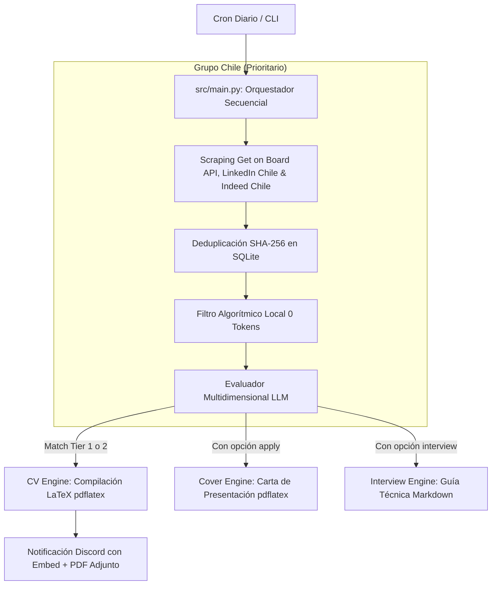

# job-fit

Sistema autónomo e interactivo de ingesta de ofertas laborales, evaluación de compatibilidad de fit (*match score*) mediante IA, compilación automatizada de **CV y Cartas de Presentación en LaTeX**, y generación de **Guías de Entrevista Técnica** para perfiles de **Data & Analytics (Data Engineer / Analytics Engineer / Data Platform)** en Chile y LATAM.

Diseñado bajo la filosofía **Ponytail (Minimalismo y YAGNI)**: arquitectura de costo $0, ejecutable en `cron` o por CLI interactiva, SQLite local, pre-filtrado algorítmico local (0 tokens) y soporte multi-proveedor LLM (**Google Gemini API / Antigravity, OpenRouter, OpenAI**).

---

## Comandos Rápidos CLI (`src/cli.py`) & Operación Diaria

> 📖 **Guía Completa de Operación:** Consulta el [**Manual Operativo y Cheat Sheet**](docs/CHEATSHEET.md) para ver todos los comandos de configuración, re-compilación manual, mantenimiento de cron y reinicio limpio.

```bash
# 1. Iniciar ingesta y scraping (Get on Board Chile, LinkedIn Chile, Indeed Chile)
PYTHONPATH=. .venv/bin/python -m src.cli scrape

# 2. Generar evaluación, CV adaptado (.pdf) y Carta de Presentación (.pdf) para una vacante (ID o URL)
PYTHONPATH=. .venv/bin/python -m src.cli apply 39

# 3. Generar la Guía de Entrevista Técnica (.md) con 12 preguntas de código/SQL y escenarios STAR
PYTHONPATH=. .venv/bin/python -m src.cli interview 39

# 4. Generar únicamente la Carta de Presentación (.pdf)
PYTHONPATH=. .venv/bin/python -m src.cli cover-letter 39

# 5. Generar/Actualizar informe analítico de mercado y estudio salarial (.md)
PYTHONPATH=. .venv/bin/python -m src.cli market-study

# 6. Recompilar manualmente un CV (.tex modificado a .pdf en 1 segundo)
pdflatex -output-directory=data/generated_cvs data/generated_cvs/NOMBRE_DEL_ARCHIVO.tex
```

---

## Diagrama de Flujo del Pipeline



---

## Características Principales

### 1. Ingesta Especializada para Chile
* **Get on Board API REST:** Ingesta directa de la API v0 oficial de `getonbrd.com`, extrayendo salarios explícitos (USD/CLP) y nombres de empresas con caché en memoria.
* **LinkedIn Guest API:** Ingesta desde los endpoints públicos no oficiales de LinkedIn (`jobs-guest/jobs/api/seeMoreJobPostings/search`), filtrando por nivel de experiencia Mid-Senior (`f_E=4`).
* **TLS Impersonation:** Utiliza `curl_cffi` para emular la huella TLS de Chrome 120, evitando detección de bots.

### 2. Pre-Filtrado Algorítmico y Configuración Dinámica (0 Tokens)
* **Single Source of Truth (`config/config.yaml`):** Todas las reglas de búsqueda, categorías de roles (`role_normalization`), patrones de tecnologías (`tracked_technologies`) y filtros algorítmicos se leen dinámicamente desde el YAML sin hardcodear expresiones regulares en Python.
* **Filtro por Título:** Exige palabras clave del rol objetivo (`title_keywords_any`).
* **Filtro por Descripción:** Exige presencia de habilidades requeridas (`description_keywords_any`).
* **Filtro Estricto de Modalidad:** Descarta vacantes 100% presenciales o con 3+ días en oficina en Chile.

### 3. Fábrica Universal y Agnóstica de LLM (`src/agent/providers.py`)
* **Google Gemini API:** Integración nativa con `gemini-3.5-flash-lite`, `gemini-3.5-flash` o `gemini-3.1-pro` usando tu API Key oficial.
* **OpenRouter:** Soporte para modelos libres o pagados (`google/gemma-3-27b-it:free`, `anthropic/claude-3.5-sonnet`, `deepseek/deepseek-r1`).
* **OpenAI / DeepSeek / Groq / Ollama Local:** Soporte para endpoints compatibles (`LLM_BASE_URL`).

### 4. Evaluación Multidimensional y Pasada Final (Catch-All)
* **Compuertas de Elegibilidad e Idioma (Hard Gates):** Mismatches de residencia o idioma asignan descarte directo (< 60%).
* **Technical Skills Match (30%):** Coincidencia en stack principal definido dinámicamente.
* **Catch-All Pass en Pipeline:** Garantiza que cualquier vacante rezagada por micro-interrupción de red o postulación manual se evalúe inmediatamente en la misma corrida sin esperar al próximo cron.

### 5. Motores de Documentos y Estudio de Mercado
* **CV Engine (`src/cv_engine/`):** Genera código `.tex` bilingüe Jinja2 y compila con `pdflatex` sin depender de binarios externos raros.
* **Interview Prep Engine (`src/interview_engine/`):** Genera guías Markdown completas con 10-12 preguntas técnicas con código y 4 escenarios STAR.
* **Continuous Market Study (`src/market_engine/`):** Genera y actualiza automáticamente el informe vivo consolidado en `data/market_study/market_study.md` usando las categorías de `config.yaml`.

---

## Estructura del Repositorio

```
job-fit/
├── AGENTS.md            # Guía de habilidades para Antigravity CLI
├── config/              # Configuración general y del perfil
│   ├── config.yaml      # Búsquedas, role_normalization, tracked_technologies, search_scope y notification_rules
│   ├── loader.py        # Cargador de YAML con caché en memoria
│   ├── profile.yaml     # Perfil del candidato (skills, experiencia, antecedentes)
│   └── settings.py      # Variables de entorno gestionadas por Pydantic Settings
├── data/                # Almacenamiento local (SQLite BD, PDFs, Estudio de mercado vivo)
├── src/                 # Código fuente principal
│   ├── agent/           # Evaluador LLM agnóstico, pre-filtro algorítmico, proveedores y cuotas
│   ├── cli.py           # Entrypoint CLI interactivo (apply, interview, cover-letter, scrape, market-study)
│   ├── cover_engine/    # Generador y compilador de Cartas de Presentación LaTeX (desactivable)
│   ├── cv_engine/       # Builder de plantillas LaTeX y compilador pdflatex
│   ├── database/        # Modelos ORM (SQLModel) y repositorio SQLite
│   ├── interview_engine/# Generador de Guías de Entrevista Técnica en Markdown
│   ├── market_engine/   # Analizador continuo de mercado laboral y salarios reales
│   ├── notifier/        # Despachador de Webhooks a Discord (Multipart PDF upload)
│   ├── scraper/         # Scrapers (Get on Board API, LinkedIn, Indeed vía JobSpy, Remotive)
│   └── main.py          # Orquestador del pipeline end-to-end (con Pasada Final Catch-All)
├── templates/           # Plantillas LaTeX (.tex) para CV y Cover Letters
└── tests/               # Suite de 39 pruebas unitarias completas (pytest)
```

---

## Requisitos e Instalación

### Pasos de Instalación
1. Clonar el repositorio:
   ```bash
   git clone https://github.com/rigbarra/job-fit.git
   cd job-fit
   ```

2. Crear el entorno virtual e instalar dependencias:
   ```bash
   python3 -m venv .venv
   source .venv/bin/activate
   pip install -r requirements.txt
   ```

3. Instalar TeX Live en Linux / WSL2:
   ```bash
   sudo apt-get update
   sudo apt-get install -y texlive-latex-base texlive-latex-extra texlive-fonts-recommended texlive-lang-spanish
   ```

4. Configurar variables de entorno (`.env`):
   ```bash
   cp .env.example .env
   ```
   Edita `.env` agregando tu `LLM_API_KEY` (Gemini, OpenRouter, DeepSeek) y `DISCORD_WEBHOOK_URL`.

5. Ejecutar la suite de pruebas unitarias:
   ```bash
   pytest
   ```
