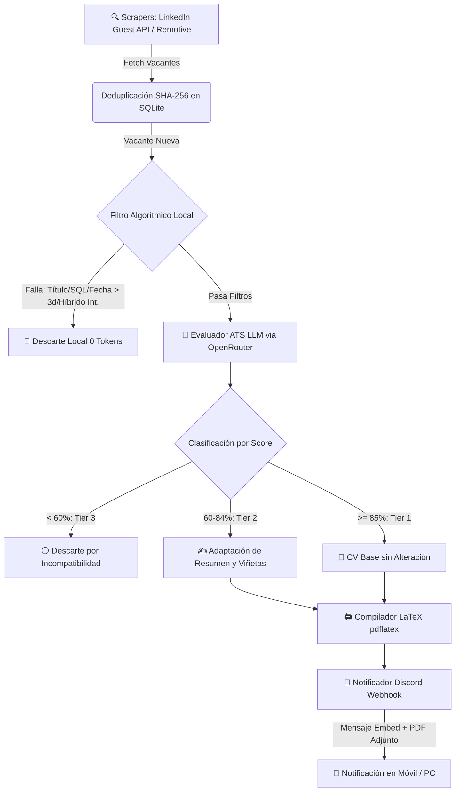

# 🚀 job-fit

Sistema autónomo de ingesta de ofertas laborales, evaluación ATS de compatibilidad (*match score*) mediante IA y compilación automatizada de CV adaptados en formato LaTeX para perfiles de **Data & Analytics (Analytics Engineer / Data Engineer)**. 

Diseñado bajo una arquitectura de **costo mínimo absoluto**, utilizando Python 3.13, SQLite local, scraping resiliente con TLS impersonation, filtros algorítmicos locales (0 tokens) y modelos LLM de costo cero vía OpenRouter.

---

## 🏗️ Arquitectura del Pipeline



---

## 📋 Características Principales

### 1. Ingesta Multifuente & Web Scraping Resiliente
* **LinkedIn Guest API:** Scraping mediante endpoints públicos no oficiales de LinkedIn (`jobs-guest/jobs/api/seeMoreJobPostings/search`). No requiere login ni cookies de sesión.
* **Remotive API:** API REST pública para vacantes 100% remotas globales.
* **TLS Impersonation & Anti-Bloqueos:** Utiliza `curl_cffi` para emular la huella TLS de Chrome 120, junto con pausas aleatorias (*throttling* de 4 a 8 seg) y un patrón de **Circuit Breaker** (detención preventiva inmediata ante errores HTTP `403` o `429`).
* **Filtro de Antigüedad (`max_job_age_days`):** Inyecta `f_TPR=r259200` en las búsquedas para obtener únicamente ofertas de las **últimas 72 horas**.

### 2. Pre-Filtrado Algorítmico Local (Ahorro del 80% en Tokens)
Antes de llamar al LLM, el pipeline aplica reglas locales estrictas:
* **Filtro por Título:** Requiere keywords de datos (`data`, `analytics`, `bi`, `dbt`, `etl`, `pipeline`, `datos`, `analista`, `ingeniero`).
* **Filtro por Descripción:** Exige presencia obligatoria de la palabra clave `sql`.
* **Filtro de Antigüedad:** Descarta ofertas con más de 3 días de publicación.
* **Reglas Estrictas de Modalidad:**
  * **Internacionales (fuera de Chile):** DEBEN ser **100% Remotas** bajo modalidad **Contractor / B2B**. Si exige presencialidad u modalidad híbrida en el extranjero, se descarta.
  * **Locales (Chile):** Permite **100% Remoto** y **Híbrido** (general o máximo 2 días presenciales por semana). Descarta ofertas 100% presenciales o que exijan 3+ días en oficina.

### 3. Evaluador ATS con Normalización Robusta de IA
* **OpenRouter Free Tier:** Conexión con modelos LLM sin costo (`openrouter/free`).
* **Normalizador de JSON (`normalize_llm_json`):** Mapea automáticamente cualquier variación de formato del LLM (ej: `match_score` $\rightarrow$ `score`, respuestas tipo lista a diccionarios) antes de validar con `Pydantic`.
* **Control de Cuotas:** Gestor `LLMQuotaManager` con backoff exponencial, jitter y control de peticiones por minuto (RPM) y límite diario.

### 4. CV Engine (Generación y Compilación LaTeX)
* **Plantillas Bilingües Jinja2:** Delimitadores personalizados compatibles con TeX (`\VAR{}`, `\BLOCK{}`) para `templates/cv/cv_base_es.tex` y `cv_base_en.tex`.
* **Sanitizador LaTeX:** Escapado automático de caracteres especiales TeX (`%`, `&`, `$`, `#`, `_`, comillas tipográficas) para prevenir fallos en `pdflatex`.
* **Compilación en Aislamiento:** Genera el archivo PDF en un directorio temporal aislado y persiste el artefacto en `data/generated_cvs/` guardando el historial en la base de datos (`CVSnapshot`).

### 5. Notificaciones Enriquecidas a Discord
* **Embeds Interactivos:** Alertas formateadas con indicador de color (🟩 Verde = Tier 1 Match Directo, 🟨 Dorado = Tier 2 Match con Retoque).
* **Enlace Directo:** Campo destacado con link limpio de 1 clic al portal de empleo.
* **PDF Adjunto Multipart:** Sube el PDF adaptado directamente en la notificación mediante peticiones `multipart/form-data` sin librerías externas.

---

## 📂 Estructura del Proyecto

```
job-fit/
├── config/              # Configuración general y del perfil
│   ├── config.yaml      # Filtros de búsqueda, fuentes, antigüedad y thresholds
│   ├── loader.py        # Cargador centralizado de YAML con cache en memoria
│   ├── profile.yaml     # Perfil del candidato (skills, experiencia, preferencias)
│   └── settings.py      # Configuración de variables de entorno (Pydantic Settings)
├── data/                # Almacenamiento de datos
│   ├── db/              # Base de datos SQLite (job_fit.db)
│   └── generated_cvs/   # PDFs y archivos .tex compilados
├── docs/                # Documentación técnica extendida y markdown de referencia
│   └── ARCHITECTURE.md  # Esquemas de BD, diagramas Mermaid y log problema-solución
├── docker/              # Entorno Dockerificado con TeX Live
├── src/                 # Código fuente principal
│   ├── agent/           # Evaluador LLM, pre-filtro algorítmico, prompts y cuotas
│   ├── cv_engine/       # Builder de plantillas LaTeX y compilador pdflatex
│   ├── database/        # Modelos ORM (SQLModel) y repositorio SQLite
│   ├── notifier/        # Despachador de Webhooks a Discord (Multipart upload)
│   ├── scraper/         # Scrapers (WebScraper base, LinkedIn, Remotive, Indeed)
│   └── main.py          # Orquestador del pipeline end-to-end
├── templates/           # Plantillas LaTeX (.tex) y hojas de estilo (.sty)
└── tests/               # Suite de 23 pruebas unitarias completas (pytest)
```

---

## 🛠️ Requisitos e Instalación Local

### Requisitos
* **Python 3.13**
* **TeX Live** (`pdflatex`) instalado en el sistema

### Pasos de Instalación
1. Clonar el repositorio:
   ```bash
   git clone https://github.com/rigbarra/job-fit.git
   cd job-fit
   ```

2. Crear entorno virtual e instalar dependencias:
   ```bash
   python3 -m venv .venv
   source .venv/bin/activate
   pip install -r requirements.txt
   ```

3. Instalar TeX Live (para compilar PDFs):
   ```bash
   sudo apt-get update
   sudo apt-get install -y texlive-latex-base texlive-latex-extra texlive-fonts-recommended texlive-lang-spanish
   ```

4. Configurar variables de entorno:
   ```bash
   cp .env.example .env
   ```
   Edita `.env` agregando tu `OPENROUTER_API_KEY` y `DISCORD_WEBHOOK_URL`.

---

## ⚡ Uso y Automatización

### Ejecución Manual Única
```bash
PYTHONPATH=. .venv/bin/python src/main.py
```

### Configuración del Comando Rápido (`jobfit`)
Para ejecutar el barrido en cualquier momento simplemente escribiendo `jobfit` en tu terminal Linux / WSL2:

```bash
echo "alias jobfit='cd /home/rigbarra/projects/job-fit && PYTHONPATH=. .venv/bin/python src/main.py'" >> ~/.bashrc
source ~/.bashrc
```

### Automatización Diaria (Crontab Local)
Para correrlo en segundo plano de Lunes a Viernes a las 08:00 AM:
```bash
crontab -e
# Agregar la siguiente línea:
0 8 * * 1-5 cd /home/rigbarra/projects/job-fit && PYTHONPATH=. /home/rigbarra/projects/job-fit/.venv/bin/python src/main.py >> /home/rigbarra/projects/job-fit/logs/pipeline.log 2>&1
```

---

## 🧪 Pruebas Unitarias

El proyecto cuenta con una suite completa de **23 tests unitarios** que se ejecutan 100% offline utilizando base de datos SQLite en memoria:

```bash
PYTHONPATH=. .venv/bin/python -m pytest -v
```

---

## 📄 Licencia
Desarrollado para uso personal de búsqueda y postulación de empleo autónoma.
