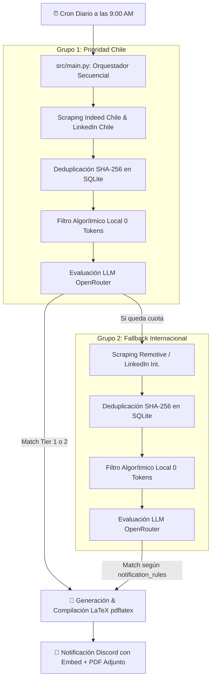

# 🚀 job-fit

Sistema autónomo de ingesta de ofertas laborales, evaluación ATS de compatibilidad (*match score*) mediante IA y compilación automatizada de CV adaptados en formato LaTeX para perfiles de **Data & Analytics (Analytics Engineer / Data Engineer)**.

Diseñado bajo la filosofía **Ponytail (Minimalismo y YAGNI)**: arquitectura de costo $0, ejecutable en `cron`, SQLite local, scraping resiliente con impersonación TLS de navegador, filtros algorítmicos locales (0 tokens) y evaluación mediante modelos LLM gratuitos vía OpenRouter.

---

## 🏗️ Diagrama de Flujo del Pipeline



---

## 📋 Características Principales

### 1. Priorización Estricta de Cuotas (Chile vs Internacional)
* **Grupos Secuenciales de Ejecución:** Prioriza las cuotas diarias del LLM evaluando primero las vacantes de Chile (Indeed Chile $\rightarrow$ LinkedIn Chile) antes de gastar recursos en fuentes internacionales (Remotive $\rightarrow$ Indeed Int. $\rightarrow$ LinkedIn Int.).
* **Interruptor de Cuota (*Circuit Breaker*):** Si se agota la cuota diaria del LLM o el modelo retorna un error 429 (Rate Limit), la ejecución se pausa de forma limpia preservando las vacantes restantes en la base de datos para la ejecución del día siguiente.

### 2. Scraping Resiliente y Anti-Bloqueos
* **LinkedIn Guest API:** Ingesta desde los endpoints públicos no oficiales de LinkedIn (`jobs-guest/jobs/api/seeMoreJobPostings/search`). Filtra directamente en la búsqueda nativa por nivel de experiencia (Mid-Senior `f_E=4`) y modalidad (`f_WT=2` remoto o `f_WT=2,3` híbrido).
* **Remotive API:** Ingesta directa desde API REST pública para empleos remotos globales.
* **TLS Impersonation:** Utiliza `curl_cffi` para emular la huella TLS de Chrome 120, evitando detección de bots.
* **Circuit Breaker HTTP:** Detiene el scraper de inmediato al detectar códigos `403` o `429`.

### 3. Pre-Filtrado Algorítmico Local (Ahorro del 80% en Tokens)
Antes de llamar al LLM, el sistema descarta localmente vacantes irrelevantes:
* **Filtro por Título:** Exige palabras clave de datos (`data`, `analytics`, `bi`, `dbt`, `etl`, `pipeline`, `datos`, `analista`, `ingeniero`).
* **Filtro por Descripción:** Exige presencia obligatoria de la habilidad clave `sql`.
* **Ventana Móvil de 24h:** Filtra únicamente ofertas publicadas en el último día (`max_job_age_days: 1`).
* **Filtro Estricto de Modalidad y Residencia:** Descarta ofertas en el extranjero que exijan residencia local en EE.UU./UK o presencia física. En Chile descarta ofertas 100% presenciales o con 3+ días en oficina.

### 4. Evaluador ATS con IA y Normalización Robusta
* **Modelo LLM Gratuito:** Integración con OpenRouter (`openrouter/free` o `google/gemma-3-27b-it:free`).
* **Normalizador Defensivo (`normalize_llm_json`):** Limpia etiquetas de razonamiento (`<think>...</think>`) y normaliza cualquier variación de clave devuelta por modelos libres antes de validar con `Pydantic`.
* **Control de RPM y Backoff:** Manejo automático de retardo y reintentos con *jitter* aleatorio.

### 5. CV Engine (Compilación Automática LaTeX)
* **Plantillas Bilingües Jinja2:** Genera código `.tex` para español (`cv_base_es.tex`) o inglés (`cv_base_en.tex`) según el idioma detectado de la oferta.
* **Sanitizador LaTeX:** Escapa caracteres especiales TeX (`%`, `&`, `$`, `#`, `_`, etc.) para prevenir errores de compilación.
* **Compilación en Aislamiento:** Genera el PDF usando `pdflatex` en directorios temporales aislados y guarda el registro en la BD (`CVSnapshot`).

### 6. Notificaciones Enriquecidas a Discord
* **Etiquetas Visuales en Tiempo Real:** Identifica al instante si la oferta es `🇨🇱 [CHILE]` o `🌐 [INTL]`.
* **Indicador por Tier de Coincidencia:**
  * 🟢 **Verde Esmeralda (Tier 1 $\ge 85\%$):** Match directo con CV base.
  * 🟡 **Amarillo Dorado (Tier 2 $60-84\%$):** Match con resumen y viñetas adaptadas al puesto.
* **PDF Adjunto Multipart:** Sube el PDF compilado directamente al canal de Discord usando `multipart/form-data` nativo de Python (`urllib`).
* **Reglas de Notificación Configurables (`notification_rules`):** Permite encender o apagar notificaciones por ubicación y Tier desde `config.yaml`.

---

## 🎛️ Reglas de Notificación Configurables (`config/config.yaml`)

Puedes controlar qué alertas recibir editando el bloque `notification_rules` en [`config/config.yaml`](file:///home/rigbarra/projects/job-fit/config/config.yaml):

```yaml
notification_rules:
  national:
    allow_tier_1: true    # 🇨🇱 Match Directo Chile
    allow_tier_2: true    # 🇨🇱 Match con Retoque Chile
  international:
    allow_tier_1: true    # 🌐 Match Directo Internacional
    allow_tier_2: false   # 🌐 Match con Retoque Internacional (Desactivado hoy para ahorrar tokens)
```

---

## 📂 Estructura del Repositorio

```
job-fit/
├── config/              # Configuración general y del perfil
│   ├── config.yaml      # Filtros de búsqueda, fuentes, antigüedad y notification_rules
│   ├── loader.py        # Cargador de YAML con cache en memoria
│   ├── profile.yaml     # Perfil del candidato (skills, experiencia, antecedentes)
│   └── settings.py      # Variables de entorno gestionadas por Pydantic Settings
├── data/                # Almacenamiento local (SQLite BD y PDFs generados)
├── docs/                # Documentación técnica de arquitectura y guía paso a paso
│   ├── ARCHITECTURE.md  # Diagramas de secuencia y esquemas de base de datos
│   └── TECHNICAL_GUIDE.md # Guía técnica detallada paso a paso para estudio del código
├── src/                 # Código fuente principal
│   ├── agent/           # Evaluador LLM, pre-filtro algorítmico, prompts y cuotas
│   ├── cv_engine/       # Builder de plantillas LaTeX y compilador pdflatex
│   ├── database/        # Modelos ORM (SQLModel) y repositorio SQLite
│   ├── notifier/        # Despachador de Webhooks a Discord (Multipart PDF upload)
│   ├── scraper/         # Scrapers (WebScraper base, LinkedIn, Remotive, Indeed)
│   └── main.py          # Orquestador del pipeline end-to-end
├── templates/           # Plantillas LaTeX (.tex) y hojas de estilo (.sty)
└── tests/               # Suite de 24 pruebas unitarias completas (pytest)
```

---

## 🛠️ Requisitos e Instalación

### Requisitos Previos
* **Python 3.13**
* **TeX Live** (`pdflatex`) instalado en el sistema

### Pasos de Instalación
1. Clonar el repositorio:
   ```bash
   git clone https://github.com/rigbarra/job-fit.git
   cd job-fit
   ```

2. Crear el entorno virtual e instalar dependencias:
   ```bash
   python3 -m venv .venv
   source .venv/bin/activate
   pip install -r requirements.txt
   ```

3. Instalar TeX Live en Linux / WSL2:
   ```bash
   sudo apt-get update
   sudo apt-get install -y texlive-latex-base texlive-latex-extra texlive-fonts-recommended texlive-lang-spanish
   ```

4. Configurar variables de entorno:
   ```bash
   cp .env.example .env
   ```
   Edita `.env` agregando tu `OPENROUTER_API_KEY` y `DISCORD_WEBHOOK_URL`.

---

## ⚡ Uso y Automatización

### Ejecución Manual
```bash
PYTHONPATH=. .venv/bin/python src/main.py
```

### Alias para Ejecución Rápida (`jobfit`)
Agrega la siguiente línea a tu shell (`~/.bashrc` o `~/.zshrc`):
```bash
alias jobfit='cd /home/rigbarra/projects/job-fit && PYTHONPATH=. .venv/bin/python src/main.py'
```

### Automatización Diaria (Crontab a las 9:00 AM)
```bash
crontab -e
# Agregar la línea:
0 9 * * * cd /home/rigbarra/projects/job-fit && PYTHONPATH=. /home/rigbarra/projects/job-fit/.venv/bin/python src/main.py >> /home/rigbarra/projects/job-fit/logs/pipeline.log 2>&1
```

---

## 🧪 Pruebas Unitarias

El proyecto cuenta con 24 tests unitarios que corren 100% offline usando SQLite en memoria y mocks HTTP:

```bash
.venv/bin/python -m pytest -v
```

---

## 📄 Licencia
Desarrollado como proyecto open-source de uso personal para automatización y optimización de búsqueda laboral.
