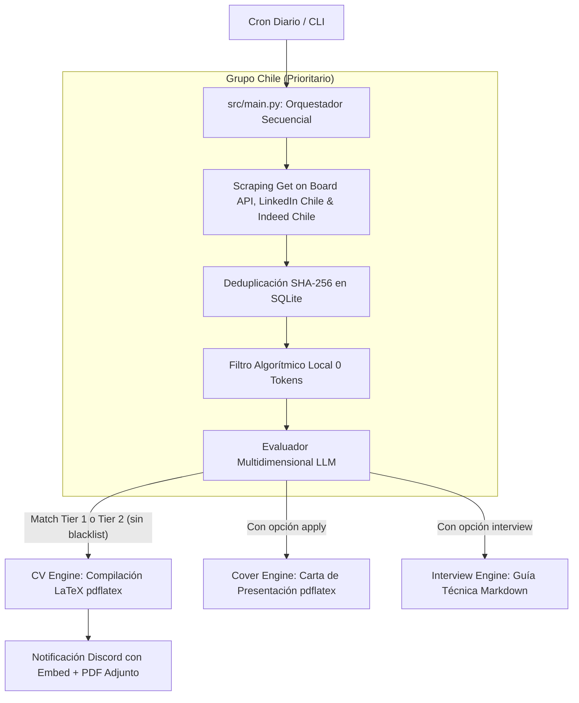

# job-fit

Sistema autónomo e interactivo de ingesta de ofertas laborales, evaluación de compatibilidad de fit (*match score*) mediante IA, compilación automatizada de **CV y Cartas de Presentación en LaTeX**, y generación de **Guías de Entrevista Técnica** para perfiles de **Data & Analytics (Data Engineer / Analytics Engineer / Data Platform)** en Chile y LATAM.

Diseñado bajo la filosofía **Ponytail (Minimalismo y YAGNI)**: arquitectura de costo $0, ejecutable en `cron` o por CLI interactiva, SQLite local, pre-filtrado algorítmico local (0 tokens) y soporte multi-proveedor LLM (**Google Gemini API / Antigravity, OpenRouter, OpenAI**).

---

## Tabla de Contenidos

1. [¿Nunca has usado una terminal? Empieza aquí](#-primeros-pasos-desde-cero-windows--wsl2)
2. [Comandos Rápidos CLI y Operación Diaria](#comandos-rápidos-cli-srcclipy--operación-diaria)
3. [Diagrama de Flujo del Pipeline](#diagrama-de-flujo-del-pipeline)
4. [Características Principales](#características-principales)
5. [Estructura del Repositorio](#estructura-del-repositorio)
6. [Requisitos e Instalación (Linux / macOS / Docker)](#requisitos-e-instalación)

---

## Primeros pasos desde cero (Windows + WSL2)

> Esta sección es para quienes nunca han usado una terminal ni instalado Python. Si ya tienes Linux o macOS con Python funcionando, salta directo a [Requisitos e Instalación](#requisitos-e-instalación).

### Paso 1 — Instalar WSL2 con Debian en Windows

WSL2 te permite correr Linux dentro de Windows sin instalar nada extra. Solo necesitas Windows 10 (versión 2004 o superior) o Windows 11.

1. Abre **PowerShell como Administrador** (clic derecho en el menú Inicio → "Windows PowerShell (Administrador)") y ejecuta:
   ```powershell
   wsl --install -d Debian
   ```
2. Cuando termine, **reinicia tu PC**.
3. Al volver, Windows abrirá automáticamente una ventana de Debian. Te pedirá crear un usuario y contraseña de Linux (puede ser cualquier nombre y clave, solo para uso local).
4. Una vez dentro, actualiza los paquetes del sistema:
   ```bash
   sudo apt-get update && sudo apt-get upgrade -y
   ```

> **¿Cómo abro la terminal de Debian después?** Busca "Debian" en el menú Inicio, o abre la app "Terminal" de Windows y selecciona Debian en el menú desplegable.

---

### Paso 2 — Instalar Git y Python

Dentro de tu terminal Debian:
```bash
sudo apt-get install -y git python3 python3-pip python3-venv
```

Verifica que todo quedó bien:
```bash
python3 --version   # debe mostrar Python 3.11 o superior
git --version       # debe mostrar git version 2.x
```

---

### Paso 3 — Obtener una API Key del proveedor de IA (elige una opción)

El sistema soporta dos proveedores. **Elige el que prefieras**, solo necesitas uno:

#### Opción A — Google AI Studio (Gemini) · Recomendado para empezar
Es gratuito y la configuración es mínima. Límite: ~1.500 requests/día con Gemini Flash Lite, suficiente para uso personal.

1. Ve a [aistudio.google.com](https://aistudio.google.com) e inicia sesión con tu cuenta Google.
2. En el panel izquierdo, haz clic en **"Get API key"** → **"Create API key"**.
3. Copia la clave (empieza con `AIzaSy...` o `AQ....`). **Guárdala**, la necesitarás en el Paso 5.

En tu `.env` usarás:
```env
LLM_API_KEY=AIzaSy...tu_clave_aqui
LLM_MODEL=gemini-2.5-flash-lite
```

#### Opción B — OpenRouter · Para acceder a otros modelos (Claude, DeepSeek, GPT-4o...)
OpenRouter es un intermediario que da acceso a decenas de modelos, varios con capa gratuita.

1. Ve a [openrouter.ai](https://openrouter.ai) y crea una cuenta.
2. Entra al **Dashboard** → **API Keys** → **Create Key**.
3. Copia la clave (empieza con `sk-or-...`). **Guárdala**, la necesitarás en el Paso 5.

En tu `.env` usarás:
```env
LLM_API_KEY=sk-or-...tu_clave_aqui
LLM_MODEL=google/gemma-3-27b-it:free
```

> El sistema detecta automáticamente el proveedor según el formato de la clave — no necesitas configurar nada más.

---

### Paso 4 — Crear un Webhook de Discord para notificaciones (opcional)

El sistema puede enviarte una notificación a Discord cada vez que encuentra una oferta que encaja con tu perfil, adjuntando el CV generado en PDF. Si no usas Discord o no te interesan las notificaciones, puedes saltarte este paso (deja `DISCORD_WEBHOOK_URL` vacío en el `.env`).

Si quieres activarlo:
1. Abre Discord → entra al servidor y canal donde quieres recibir las alertas.
2. Clic en el ícono ⚙️ del canal → **"Integraciones"** → **"Webhooks"** → **"Nuevo Webhook"**.
3. Dale un nombre (ej: `job-fit-bot`), copia la **URL del Webhook** y guárdala.

---

### Paso 5 — Clonar el proyecto y configurarlo

```bash
# Clonar el repositorio
git clone https://github.com/rigbarra/job-fit.git
cd job-fit

# Crear el entorno virtual de Python (una carpeta aislada con las dependencias)
python3 -m venv .venv
source .venv/bin/activate

# Instalar dependencias
pip install -r requirements.txt

# Instalar TeX Live (para compilar los CVs a PDF)
sudo apt-get install -y texlive-latex-base texlive-latex-extra texlive-fonts-recommended texlive-lang-spanish

# Copiar los archivos de configuración de ejemplo
cp .env.example .env
cp config/profile.example.yaml config/profile.yaml
```

Ahora edita los dos archivos que copiaste:

**`.env`** — abre con cualquier editor de texto:
```bash
nano .env
```
Reemplaza los valores de ejemplo con los tuyos:
```env
LLM_API_KEY="pega-aqui-tu-api-key-de-google-ai-studio"
DISCORD_WEBHOOK_URL="pega-aqui-tu-webhook-url-o-deja-vacio"
LLM_MODEL="gemini-2.5-flash-lite"
```
Guarda con `Ctrl+O`, `Enter`, `Ctrl+X`.

**`config/profile.yaml`** — abre y reemplaza los datos del perfil de ejemplo (Alex Morgan) con los tuyos: nombre, teléfono, email, LinkedIn, experiencia laboral y educación. Este archivo es tu CV en formato texto.

---

### Paso 6 — Verificar que todo funciona

```bash
pytest
```

Si todos los tests pasan (o solo falla alguno relacionado a LaTeX), el sistema está listo.

Para hacer una primera ejecución manual:
```bash
PYTHONPATH=. .venv/bin/python -m src.cli scrape
```

Verás en la terminal cómo el sistema busca ofertas, las evalúa con IA y te notifica en Discord las que coinciden con tu perfil.

---

### ¿Y si algo falla?

Los errores más comunes y su solución:

| Error | Causa | Solución |
|---|---|---|
| `pdflatex: command not found` | TeX Live no instalado | `sudo apt-get install -y texlive-latex-extra` |
| `LLM_API_KEY not set` | Falta la clave en `.env` | Editar `.env` con la clave real |
| `ModuleNotFoundError` | Entorno virtual no activado | Ejecutar `source .venv/bin/activate` |
| `Permission denied` | Falta permisos en un script | `chmod +x scripts/run_pipeline.sh` |

---

## Comandos Rápidos CLI (`src/cli.py`) & Operación Diaria

> **¿Necesito un asistente de IA (Antigravity, Claude, Cursor...) para usar esto?**
> No. El proyecto es un CLI Python puro que se ejecuta directamente en la terminal.
> Los comandos `/scrape`, `/apply` etc. que aparecen en `AGENTS.md` son atajos opcionales
> para quienes usan Antigravity CLI — hacen exactamente lo mismo que los comandos de abajo.
> Si usas cualquier otro asistente o ninguno, los comandos de esta sección son todo lo que necesitas.

> 📖 **Guía Completa de Operación:** Consulta el [**Manual Operativo y Cheat Sheet**](docs/CHEATSHEET.md) para ver todos los comandos de configuración, re-compilación manual, mantenimiento de cron y reinicio limpio.

```bash
# 1. Iniciar ingesta y scraping (Get on Board Chile, LinkedIn Chile, Indeed Chile)
PYTHONPATH=. .venv/bin/python -m src.cli scrape

# 2. Generar evaluación, CV adaptado (.pdf) y Carta de Presentación (.pdf) para una vacante (ID o URL)
PYTHONPATH=. .venv/bin/python -m src.cli apply 39

# 3. Generar la Guía de Entrevista Técnica (.md) con 12 preguntas de código/SQL y escenarios STAR
PYTHONPATH=. .venv/bin/python -m src.cli interview 39

# 4. Generar únicamente la Carta de Presentación (.pdf)
PYTHONPATH=. .venv/bin/python -m src.cli cover-letter 39

# 5. Generar CV Estándar / Base (Español e Inglés, sin IA, descarga directa a Windows)
PYTHONPATH=. .venv/bin/python -m src.cli cv
# O solo un idioma:
PYTHONPATH=. .venv/bin/python -m src.cli cv --lang es   # o --lang en

# 6. Generar/Actualizar informe analítico de mercado y estudio salarial (.md y Streamlit Web)
PYTHONPATH=. .venv/bin/python -m src.cli market-study
# O abrir directamente el Dashboard Interactivo Streamlit (Catppuccin Dark):
.venv/bin/streamlit run src/market_engine/app.py

# 7. Recompilar manualmente un CV (.tex modificado a .pdf en 1 segundo)
pdflatex -output-directory=data/generated_cvs data/generated_cvs/NOMBRE_DEL_ARCHIVO.tex
```

---

## Diagrama de Flujo del Pipeline



---

## Características Principales

### 1. Ingesta Especializada para Chile
* **Get on Board API REST:** Ingesta directa de la API v0 oficial de `getonbrd.com`, extrayendo salarios explícitos (USD/CLP) y nombres de empresas con caché en memoria.
* **LinkedIn Guest API:** Ingesta desde los endpoints públicos no oficiales de LinkedIn (`jobs-guest/jobs/api/seeMoreJobPostings/search`), filtrando por nivel de experiencia Mid-Senior (`f_E=4`).
* **TLS Impersonation:** Utiliza `curl_cffi` para emular la huella TLS de Chrome 120, evitando detección de bots.

### 2. Pre-Filtrado Algorítmico y Configuración Dinámica (0 Tokens)
* **Single Source of Truth (`config/config.yaml`):** Todas las reglas de búsqueda, categorías de roles (`role_normalization`), patrones de tecnologías (`tracked_technologies`), empresas en blacklist (`excluded_companies`) y filtros algorítmicos se leen dinámicamente desde el YAML.
* **Blacklist Selectiva por Empresa (`excluded_companies`):** Permite procesar ofertas de empresas con procesos lentos (ej: BairesDev) para alimentarlas al Estudio de Mercado, pero silenciando alertas en Discord y omitiendo compilaciones de CV.
* **Filtro Estricto de Modalidad:** Descarta vacantes 100% presenciales o con 3+ días en oficina en Chile.

### 3. Fábrica Universal y Agnóstica de LLM (`src/agent/providers.py`)
* **Google Gemini API:** Integración nativa con `gemini-3.5-flash-lite`, `gemini-3.5-flash` o `gemini-3.1-pro` usando tu API Key oficial.
* **OpenRouter:** Soporte para modelos libres o pagados (`google/gemma-3-27b-it:free`, `anthropic/claude-3.5-sonnet`, `deepseek/deepseek-r1`).
* **OpenAI / DeepSeek / Groq / Ollama Local:** Soporte para endpoints compatibles (`LLM_BASE_URL`).

### 4. Evaluación Multidimensional y Pasada Final (Catch-All)
* **Compuertas de Elegibilidad e Idioma (Hard Gates):** Mismatches de residencia o idioma asignan descarte directo (< 60%).
* **Technical Skills Match (30%):** Coincidencia en stack principal definido dinámicamente y priorización inteligente de categorías de habilidades según la vacante (IA, BI, Data Engineering, Cloud).
* **Catch-All Pass en Pipeline:** Garantiza que cualquier vacante rezagada por micro-interrupción de red o postulación manual se evalúe inmediatamente en la misma corrida sin esperar al próximo cron.

### 5. Motores de Documentos, Nombres Cronológicos y Dashboard Streamlit
* **CV Engine (`src/cv_engine/`):** Genera archivos con nombre estandarizado y ordenable alfabéticamente (`{yymmdd}_CV_{slug}_{cargo}_{empresa}.pdf`) y compila Jinja2 + `pdflatex` con re-ordenamiento inteligente de habilidades técnicas según la oferta.
* **Interview Prep Engine (`src/interview_engine/`):** Genera guías Markdown completas con 10-12 preguntas técnicas con código y 4 escenarios STAR.
* **LinkedIn Content Engine (`src/linkedin_engine/`):** Genera ideas de publicaciones técnicas y estrategia SEO para LinkedIn en Obsidian a partir de las ofertas más demandadas.
* **Continuous Market Study (`src/market_engine/`):** Genera y actualiza automáticamente el informe vivo en `data/market_study/market_study.md` y ofrece el Dashboard Interactivo Web en Streamlit (`app.py`) con tema Catppuccin Dark y monitoreo de sueldos en IA.

---

## Estructura del Repositorio

```
job-fit/
├── AGENTS.md            # Guía de habilidades para Antigravity CLI
├── LICENSE              # Licencia MIT de código abierto
├── config/              # Configuración general y del perfil
│   ├── config.yaml      # Búsquedas, role_normalization, tracked_technologies, excluded_companies, search_scope
│   ├── profile.example.yaml # Plantilla de perfil sanitizada y lista para personalizar
│   ├── profile.yaml     # Perfil del candidato (ignorado en git para privacidad)
│   └── settings.py      # Variables de entorno gestionadas por Pydantic Settings
├── docker/              # Dockerfile de producción con Python 3.13 + TeX Live
├── docker-compose.yml   # Orquestación de contenedores
├── data/                # Almacenamiento local (SQLite BD, PDFs, Estudio de mercado)
├── output/              # Salidas agnósticas (Obsidian vault, descargas)
├── src/                 # Código fuente principal
│   ├── agent/           # Evaluador LLM agnóstico, pre-filtro algorítmico, proveedores y cuotas
│   ├── cli.py           # Entrypoint CLI interactivo (apply, interview, cover-letter, scrape, market-study, linkedin)
│   ├── cover_engine/    # Generador y compilador de Cartas de Presentación LaTeX
│   ├── cv_engine/       # Builder de plantillas LaTeX dinámicas y compilador pdflatex
│   ├── database/        # Modelos ORM (SQLModel) y repositorio SQLite
│   ├── interview_engine/# Generador de Guías de Entrevista Técnica en Markdown
│   ├── linkedin_engine/ # Generador de contenidos y estrategia SEO para LinkedIn
│   ├── market_engine/   # Analizador de mercado (analytics.py) y Dashboard Streamlit (app.py)
│   ├── notifier/        # Despachador de Webhooks a Discord (Multipart PDF upload)
│   ├── obsidian_exporter.py # Exportador agnóstico de fichas Kanban para Obsidian
│   ├── scraper/         # Scrapers (Get on Board API, LinkedIn, Indeed, Remotive)
│   └── main.py          # Orquestador del pipeline end-to-end (con Pasada Final Catch-All)
├── templates/           # Plantillas LaTeX (.tex) dinámicas para CV y Cover Letters
└── tests/               # Suite de 60 pruebas unitarias completas (pytest)
```

---

## Requisitos e Instalación

### Opción A: Instalación Local (Linux / WSL2 / macOS)

1. Clonar el repositorio:
   ```bash
   git clone https://github.com/rigbarra/job-fit.git
   cd job-fit
   ```

2. Crear el entorno virtual e instalar dependencias:
   ```bash
   python3 -m venv .venv
   source .venv/bin/activate
   pip install -r requirements.txt
   ```

3. Instalar TeX Live (para compilar CVs a PDF):
   ```bash
   # En Debian / Ubuntu / WSL2:
   sudo apt-get update
   sudo apt-get install -y texlive-latex-base texlive-latex-extra texlive-fonts-recommended texlive-lang-spanish
   ```

4. Configurar tu perfil y variables de entorno:
   ```bash
   cp .env.example .env
   cp config/profile.example.yaml config/profile.yaml
   ```
   Edita `.env` con tus API keys y `config/profile.yaml` con tu experiencia real.

5. Ejecutar la suite de pruebas unitarias:
   ```bash
   pytest
   ```

### Opción B: Ejecución Rápida con Docker (Cero dependencias del sistema)

Si no deseas instalar TeX Live ni configurar Python localmente:

```bash
# 1. Copiar configuración
cp .env.example .env
cp config/profile.example.yaml config/profile.yaml

# 2. Construir la imagen
docker compose build

# 3. Ejecutar comandos CLI
docker compose run --rm job-fit scrape
docker compose run --rm job-fit apply 39
docker compose run --rm job-fit --help
```
