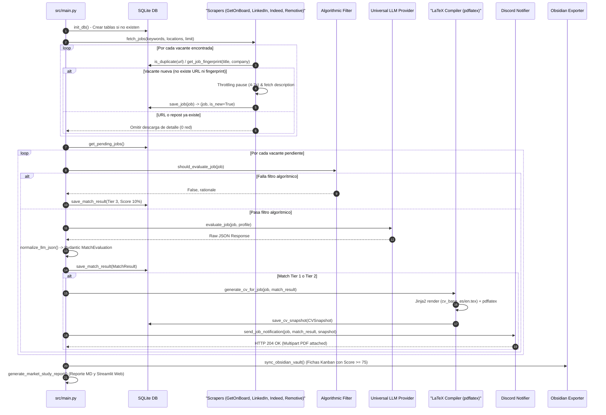
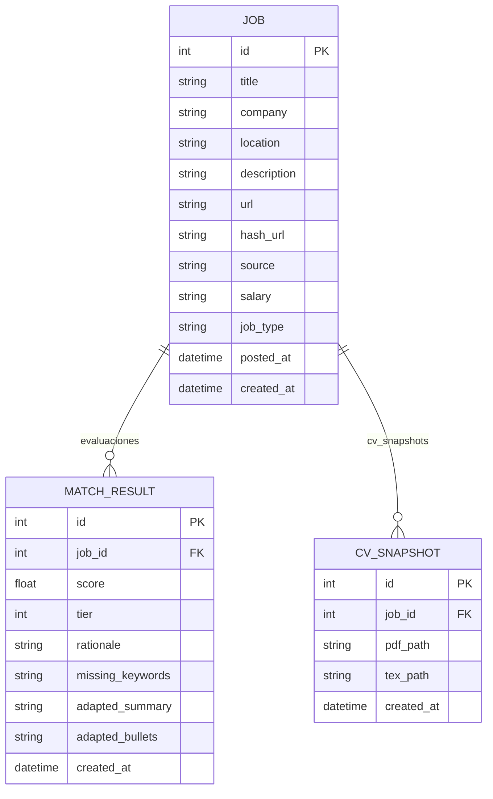

# 📐 Documentación de Arquitectura Técnica — job-fit

Este documento detalla la estructura interna, el modelo de datos, la ingeniería de prompts y las soluciones técnicas implementadas en el proyecto `job-fit`.

---

## 1. Diagrama de Secuencia End-to-End

---

## 2. Modelo de Datos Relacional (ERD)

La persistencia se realiza mediante **SQLite** y el ORM **SQLModel** (basado en SQLAlchemy 2.0 y Pydantic v2).

### Descripción de Tablas

* **`Job`**: Almacena las vacantes crudas extraídas por los scrapers. Utiliza doble deduplicación: `hash_url` (SHA-256 de la URL limpia) y `fingerprint` (SHA-256 normalizado de `empresa + titulo`) para eliminar reposts idénticos a 0 costo de red.
* **`MatchResult`**: Guarda la evaluación generada por el LLM o por el filtro algorítmico. 
  * `tier = 1`: Match Alto ($\ge 85\%$). Postulación directa con CV base.
  * `tier = 2`: Match Medio ($60\% - 84\%$). Genera CV adaptado inyectando `adapted_summary` y `adapted_bullets`.
  * `tier = 3`: Descarte ($< 60\%$). No genera PDF ni notifica a Discord.
* **`CVSnapshot`**: Registra la ruta absoluta del PDF compilado y su correspondiente código fuente `.tex` para mantener trazabilidad histórica.

---

## 3. Matriz de Filtros y Reglas de Negocio

| Categoría | Filtro | Regla de Negocio | Acción ante Mismatch |
|---|---|---|---|
| **Deduplicación** | SHA-256 URL + Fingerprint | Si `hash_url` o `fingerprint` (Empresa + Título) ya existen en la tabla `job` | Omite descarga de detalle y evita inserciones repetidas (0 consumo de red) |
| **Título** | `title_keywords_any` | El título debe contener palabras clave de datos (`data`, `analytics`, `bi`, `dbt`, `etl`, `pipeline`, `ai engineer`, etc.) | Descarte Algorítmico Tier 3 (0 tokens LLM) |
| **Descripción** | `description_keywords_any` | La descripción debe contener al menos una tecnología del stack (`sql`, `python`, `aws`, `gcp`, `azure`, `snowflake`, `bigquery`, `pyspark`, `dbt`, `airflow`, `dagster`, etc.) | Descarte Algorítmico Tier 3 (0 tokens LLM) |
| **Antigüedad** | `max_job_age_days` | Publicada en las últimas **24 horas (1 día)** para ciclo de cron 3x diario | Descarte Algorítmico Tier 3 (0 tokens LLM) |
| **Modalidad Int.** | Remoto / Contractor | Ofertas fuera de Chile DEBEN ser **100% Remotas** o **Contractor B2B** | Descarte Algorítmico Tier 3 (0 tokens LLM) |
| **Modalidad Chile** | Remoto / Híbrido $\le 2$d | En Chile se acepta 100% Remoto e Híbrido (general o $\le 2$ días/semana) | Descarte si es 100% Presencial o exige 3+ días en oficina |

---

## 4. Registro de Problemas y Soluciones Técnicas

### 🔴 Problema 1: Variaciones de Esquema JSON en LLMs Gratuitos (`openrouter/free`)
* **Síntoma:** Modelos gratuitos pequeños de OpenRouter a veces devuelven `match_score` en vez de `score`, o devuelven `adapted_bullets` como una lista `[{'clave': '...', 'valor': '...'}]` en lugar de un diccionario `{original: adaptado}`.
* **Solución:** Implementación de la función `normalize_llm_json()` en [`src/agent/evaluator.py`](../src/agent/evaluator.py). Parsea flexiblemente sinónimos de claves y convierte listas de viñetas en un diccionario `dict[str, str]` normalizado antes de la validación estricta con `Pydantic`.

### 🔴 Problema 2: Bloqueos de Red e IP en Scraping (Cloudflare / HTTP 429)
* **Síntoma:** Scraping masivo tradicional desencadena bloqueos por firma TLS de Python (`requests` o `urllib`).
* **Solución:** 
  1. Uso de `curl_cffi` para emular la huella TLS de Chrome 120.
  2. Implementación de la clase abstracta [`WebScraper`](../src/scraper/base.py) con pausas aleatorias de 4 a 8 segundos antes de bajar detalles.
  3. **Circuit Breaker:** Si se detecta una respuesta `403` o `429`, el scraper aborta inmediatamente la búsqueda para proteger la dirección IP.

### 🔴 Problema 3: Errores de Compilación TeX por Caracteres Especiales del LLM
* **Síntoma:** `pdflatex` falla al compilar cuando el texto adaptado por la IA incluye %, &, $, #, _ o comillas dobles.
* **Solución:** Función `escape_latex()` en [`src/cv_engine/builder.py`](../src/cv_engine/builder.py). Escapa mediante expresiones regulares los caracteres especiales que no estén ya escapados sin alterar comandos LaTeX legítimos.

### 🔴 Problema 4: Envío de PDFs Adjuntos a Discord sin Dependencias Pesadas
* **Síntoma:** La API de Discord requiere peticiones `multipart/form-data` para adjuntar archivos junto con el JSON del Embed.
* **Solución:** Implementación nativa usando `urllib.request` con delimitadores `boundary` generados con `uuid.uuid4().hex` en [`src/notifier/discord.py`](../src/notifier/discord.py). Evita la dependencia de `requests` estándar que arroja `NotImplementedError` en `curl_cffi` con multipart.

---

## 5. Glosario de Tecnologías
* **SQLModel / SQLAlchemy 2.0:** ORM Python para interacción con la base de datos relacional.
* **curl_cffi:** Cliente HTTP en C que soporta cURL con impersonación de TLS/JA3 de navegadores reales.
* **OpenRouter:** Router de APIs de LLMs que permite alternar y acceder a modelos de código abierto y gratuitos.
* **pdflatex / TeX Live:** Motor de composición tipográfica utilizado para compilar los CVs profesionales.
